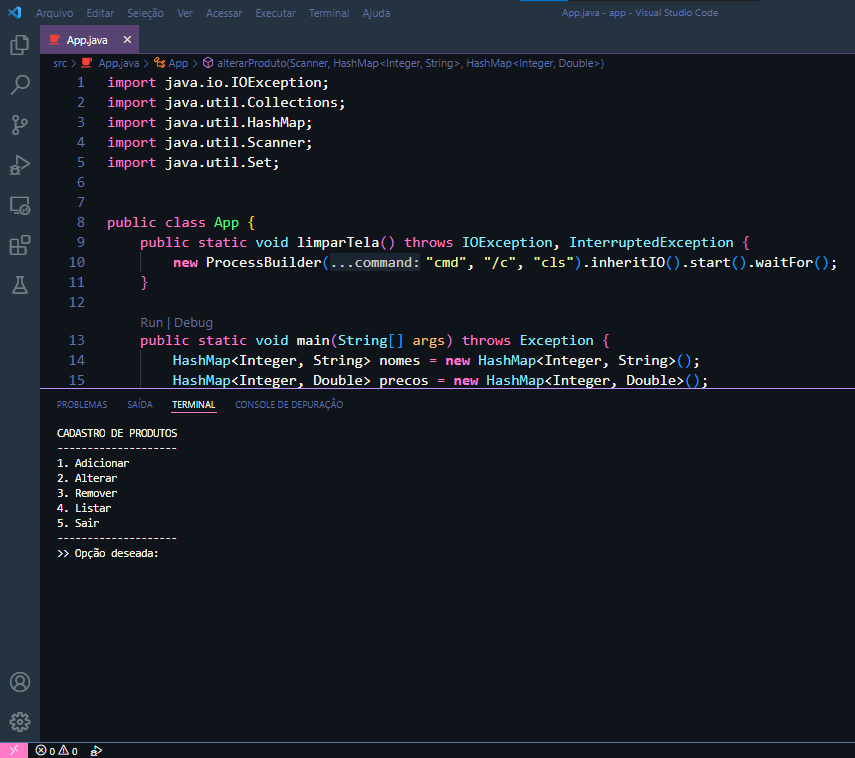
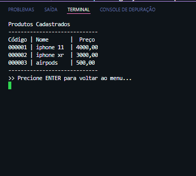
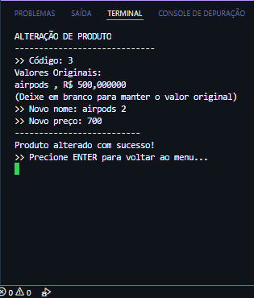
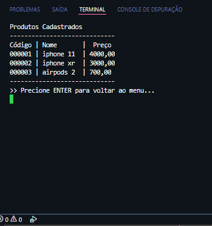
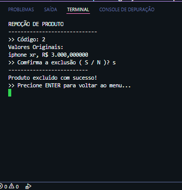
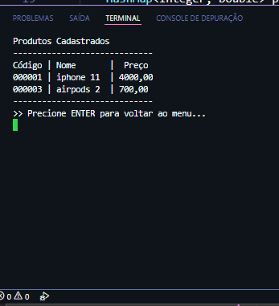

## Projeto de práticas em Java

### Este Exercício aborda a manipulação de coleções de objetos usando tipos especializados e com recursos avançados, incluindo o ArrayList, LinkedList, HashSet e HashMap.

### segue abaixo uma breve demonstração da execução do código:

A primeira Saída do terminal mostrada, é o menu "Cadastro de Produtos" que lista 5 opções funcionais - 

Após escolhida uma opção aqui dada a " 1 " que se trata de adicionar um produto, o usuário declara o NOME do produto e o seu PREÇO - 

Para melhor exemplificação, adicionei alguns produtos na lista e selecionei a opção " 4 " para mostrar a lista de produtos cadastrados.
Nota-se que cada um deles é gerado um código de id automáticamente -

Agora seleciono a opção " 2 " de alteração, que nela busco o item pelo codigo e logo após aparece uma compirmação do mesmo.
E então digito seu novo nome e o seu novo preço -

Mostrando que o produto foi alterado e já consta na lista -

Na opção " 3 " que se trata da REMOÇÂO, eu busco o produto e o mesmo é me mostrado, e então eu tenho a opção se quero exclui-lo ou não " S / N ".
escolho que "S" -

Mostrando que o produto foi removido e já não consta mais na lista -

